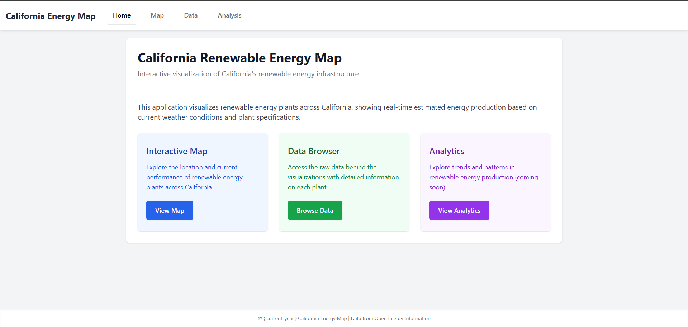

# California Energy Map

An interactive web application for visualizing and analyzing renewable energy plants across California with real-time weather data integration. Submission for the Technology Student Association Nationals 2025 Competition



## Overview

This Flask-based web application provides an interactive visualization of California's renewable energy infrastructure. It fetches real-time weather data and calculates estimated energy production based on current conditions for solar, wind, and hydroelectric power plants.

## Features

- **Interactive Map**: Visualize the location and type of renewable energy plants across California
- **Real-time Data**: Integration with OpenWeatherMap API to fetch current weather conditions
- **Production Estimation**: Algorithm to estimate energy output based on weather and plant characteristics
- **Data Browser**: View and filter the complete dataset of power plants
- **Analysis Dashboard**: Visual insights into energy production patterns and weather correlations
- **Responsive Design**: Works seamlessly on desktop and mobile devices

## Technology Stack

- **Backend**: Python, Flask
- **Frontend**: HTML, Tailwind CSS, JavaScript
- **Data Processing**: Pandas, NumPy
- **Visualization**: Folium, Matplotlib
- **External APIs**: OpenWeatherMap

## Installation

1. Clone the repository:
   ```
   git clone https://github.com/yourusername/california-energy-map.git
   cd california-energy-map
   ```

2. Create a virtual environment and activate it:
   ```
   python -m venv venv
   source venv/bin/activate  # On Windows: venv\Scripts\activate
   ```

3. Install dependencies:
   ```
   pip install -r requirements.txt
   ```

4. Configure the application:
   - Add your OpenWeatherMap API key to `config.py`
   - Ensure your data files are in the correct `data/` directory

5. Run the application:
   ```
   python run.py
   ```

6. Open your browser and navigate to:
   ```
   http://127.0.0.1:5000/
   ```

## Project Structure

```
project_root/
├── app/
│   ├── __init__.py            # Flask app initialization
│   ├── routes/                # Route definitions
│   ├── static/                # Static files (CSS, JS, images)
│   │   ├── css/
│   │   ├── js/
│   │   ├── img/               # Analysis images
│   │   └── generated/         # Generated map files
│   ├── templates/             # HTML templates
│   └── utils/                 # Utility functions
│       ├── data_handler.py    # Data processing functions
│       └── map_generator.py   # Map generation functions
├── data/                      # Data files
├── config.py                  # Configuration settings
├── requirements.txt           # Python dependencies
└── run.py                     # Application entry point
```

## Data Sources

The application uses data from:
- California Energy Commission
- OpenWeatherMap API for real-time weather conditions

## Analysis

The application includes several visualizations that provide insights into California's renewable energy infrastructure:

1. **Average Power Output by Energy Source**: Comparison between solar and wind energy output
2. **Temperature vs Solar Power Output**: How temperature affects solar energy production
3. **Wind Speed vs Wind Power Output**: Correlation between wind speed and power generation
4. **Power Output Heatmap**: Geographic distribution of energy production
5. **Correlation Matrix**: Relationships between weather variables and energy output

## Future Enhancements
- Predictive modeling for energy output
- User accounts for saving custom views
- Additional energy source types
- Integration with real-time grid data

## License

[MIT License](LICENSE)

## Acknowledgements

- Data provided by the California Energy Commission
- Weather data from OpenWeatherMap API
- Icons and design elements from Tailwind CSS
